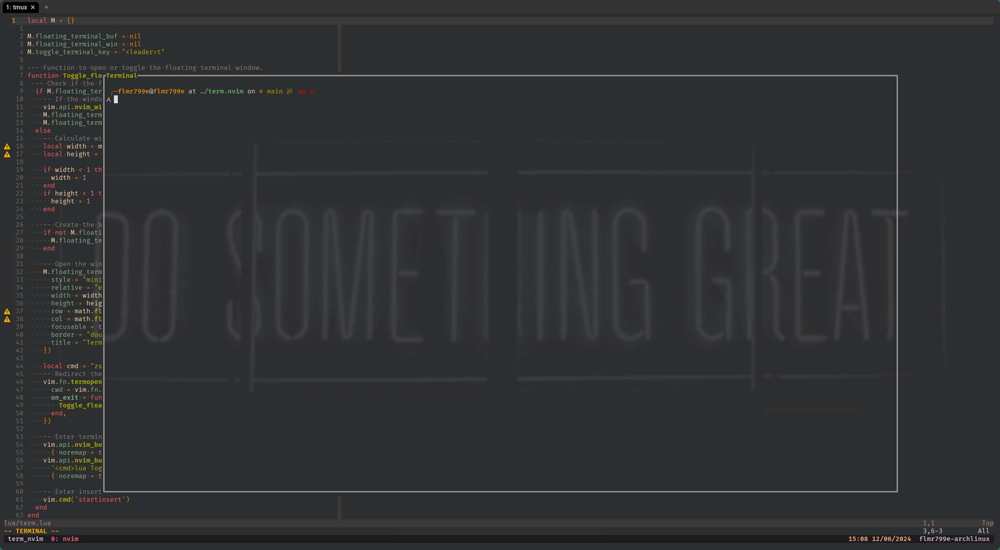

# term.nvim



This is a simple Neovim terminal plugin that allows you to open or toggle a floating terminal window within Neovim. The plugin provides a function called `Toggle_floating_terminal()` that can be used to open or close the terminal window. The default keybinding to toggle the terminal is `<leader>t`.

## Table of Contents

- [Usage](#Usage)
- [Customization](#customization)
- [Example](#example-configuration)

## Usage

To use the plugin, you can call the `Toggle_floating_terminal()` function or use the default keybinding `<leader>t`. When the terminal window is opened, it will be displayed as a floating window in the center of the editor. The size of the terminal window is calculated based on the current size of the Neovim editor window.

## Customization

The plugin provides a `setup()` function that allows you to customize the behavior of the terminal window. You can pass an options table to the `setup()` function to customize the terminal keybinding. For example, if you want to change the toggle terminal key to `<leader>z`, you can do the following:

```lua
M.setup({ toggle_terminal_key = "<leader>z" })
```

## Example Configuration

Here's an example configuration that sets up the plugin with a custom toggle terminal key:

```lua
local term = require('term')

term.setup({
  toggle_terminal_key = "<leader>z"
})
```
